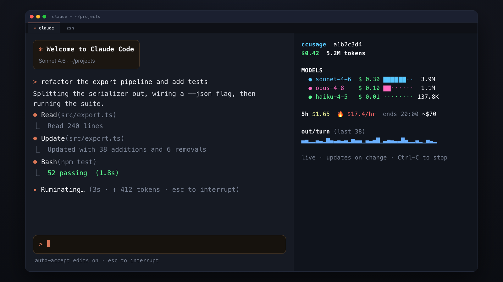

# ccusage-backpack-monitor

A Claude Code plugin that pops open a **side pane** showing a **live,
change-driven [ccusage](https://github.com/ryoppippi/ccusage) readout** for the
session you just started — and closes that pane automatically when the session
ends. Think of it as a usage "backpack" your session carries while it runs.

It works in **tmux**, **WezTerm**, and **iTerm2**, on **macOS and Linux**.

<p align="center">
  
</p>

> **Status:** v0.6.0 — supports tmux (macOS/Linux), WezTerm (macOS/Linux), and
> iTerm2 (macOS). In any other terminal the hooks no-op silently, so it's safe
> to install anywhere.

## Why

`/usage` is a one-shot, machine-local snapshot. This gives you an always-on,
per-session readout in a pane beside your work — without polling on a timer.
It watches only *this* session's transcript file for changes and runs `ccusage`
only when something actually changed, so it's near-live yet idle-cheap.

## Requirements

- **A supported terminal**, any one of:
  - **tmux** (macOS or Linux) — the pane is a `tmux split-window`.
  - **WezTerm** (macOS or Linux) — the pane is a `wezterm cli split-pane`.
  - **iTerm2** (macOS) — the pane is opened via iTerm2's AppleScript.

  Detection is automatic and ordered **tmux → WezTerm → iTerm2**, so if you run
  tmux inside iTerm2 or WezTerm, the tmux split is used (the multiplexer owns the
  layout). You can force a choice with `CBM_BACKEND` (see Configuration).
- [`ccusage`](https://github.com/ryoppippi/ccusage) — `brew install ccusage` on
  macOS, `npm i -g ccusage` (or `bun add -g ccusage`) on Linux. It otherwise
  falls back to `npx`/`bunx`/`deno` if one is present. ccusage is a JavaScript
  CLI, so it needs **some** runtime — if none is found, the pane tells you
  exactly that and how to fix it (rather than hanging or failing cryptically).
- **`python3`** powers the *rich* colored panel + sparkline. It is resolved via
  your `PATH`. It is **not required** for the plugin to work: the hooks parse
  their input in pure shell, so the pane still opens without python3 and simply
  shows plain `ccusage session` text instead of the rich panel — no error.
- On iTerm2 only, a one-time macOS Automation prompt ("iTerm wants to control
  iTerm") must be allowed.

### Where it works (and where it no-ops)

| Scenario | Behaviour |
|---|---|
| tmux / WezTerm / iTerm2 + ccusage + python3 | Full rich panel (cost, burn rate, sparkline) |
| Supported terminal, no python3 | Plain `ccusage` text fallback, still live |
| Supported terminal, **no ccusage / no JS runtime** | Pane shows the exact, OS-aware fix and becomes a shell so you can run it |
| tmux or WezTerm on **Linux** | Full support |
| Any other terminal (plain Terminal.app, kitty, Ghostty, …) | Hooks **no-op silently** (safe to leave installed) |

No `watch`, `jq`, or charting libraries are required — the only hard runtime
dependencies are `ccusage`, a supported terminal, and (for the rich view) the
stock `python3`.

## Install

Inside Claude Code:

```text
/plugin marketplace add thekoalaperson/ccusage-backpack-monitor
/plugin install ccusage-backpack-monitor@ccusage-backpack-monitor
```

Then start a fresh `claude` in tmux, WezTerm, or iTerm2 — a side pane opens
automatically.

<details>
<summary>Local development install</summary>

Point the marketplace at a local checkout instead of GitHub:

```text
/plugin marketplace add /path/to/ccusage-backpack-monitor
/plugin install ccusage-backpack-monitor@ccusage-backpack-monitor
```
</details>

## Commands

`/ccusage-backpack-monitor:ccusage-monitor` — open the monitor pane for the
**current** session on demand (handy if it isn't open, or you closed it). Plugin
commands are namespaced, so type `/ccusage` and let autocomplete finish it.

## Configuration

Set these as environment variables before launching `claude`:

| Var                  | Default       | Meaning                                              |
|----------------------|---------------|------------------------------------------------------|
| `CBM_POLL`           | `3`           | Seconds between cheap file-change checks              |
| `CBM_SPLIT`          | `vertically`  | `vertically` (side-by-side) or `horizontally`        |
| `CBM_BACKEND`        | _(auto)_      | Force a terminal backend: `tmux`, `wezterm`, or `iterm`. Unset = auto-detect (tmux → WezTerm → iTerm2). |
| `CBM_WEZTERM_PERCENT`| `40`          | WezTerm split size as a percent of the source pane   |
| `CBM_BLOCKS`         | `1`           | `0` hides the 5h burn-rate/projection section (skips that account-wide call entirely) |
| `CBM_BLOCKS_TTL`     | `30`          | Seconds to cache the burn-rate call so frequent turns don't re-trigger the scan |
| `CBM_GRAPH`          | `1`           | `0` hides the sparkline                              |
| `CBM_BG`             | _(unset)_     | A 256-color index (e.g. `234`) paints an opaque background card behind the panel — useful in **transparent terminals**. Unset = solid high-contrast text, no fill. |

The panel shows **every model used in the session** with its own cost, a cost-share
bar, and token count (sessions that switched models show each one, not a `+N`).

## Performance

The watcher is **change-driven, not interval-driven**. When idle it only does a
cheap `stat` on this session's transcript every `CBM_POLL` seconds — no `ccusage`
process, no parsing. It renders only when the transcript actually changes, so
cost is proportional to real activity, not wall-clock time. The account-wide
burn-rate call is cached (`CBM_BLOCKS_TTL`), and the sparkline reads only the tail
of the transcript, so a render stays ~0.1s regardless of session length.

## How it works

| Phase  | File                | Hook           | Action                                          |
|--------|---------------------|----------------|-------------------------------------------------|
| open   | `bin/open-pane.sh`  | `SessionStart` | split pane, run watcher, stash the backend + pane handle |
| render | `bin/watch.sh`      | —              | stat transcript; on change, draw the panel      |
| panel  | `lib/render.py`     | —              | rich colored cost/burn-rate/sparkline view      |
| close  | `bin/close-pane.sh` | `SessionEnd`   | look up the handle, close that exact pane via its backend |

**Backends.** All terminal-specific logic lives in `lib/common.sh` as small
per-backend functions — `cbm_{detect,open,alive,close}_<backend>`. A cached
`cbm_backend()` picks the active one (tmux → WezTerm → iTerm2). Adding a new
terminal (kitty, Ghostty, …) is four functions plus one word in that list.

State (one tiny `<session-id>.pane` file per session) lives in
`~/.local/state/ccusage-backpack-monitor` and self-prunes after a day. It records
the **backend** and the **pane handle** (two lines) so the `SessionEnd` hook — a
fresh process whose environment may differ — closes via the recorded backend
rather than re-detecting. (A fixed path on purpose: the hooks and the slash
command must agree on it, so the close hook can find a pane the command opened.)

## Roadmap

- More terminals: kitty, Ghostty (tmux, WezTerm, and iTerm2 are supported)
- A companion skill/command for on-demand usage summaries
- Optional context-window % and per-model cost split in the panel

## License

MIT
