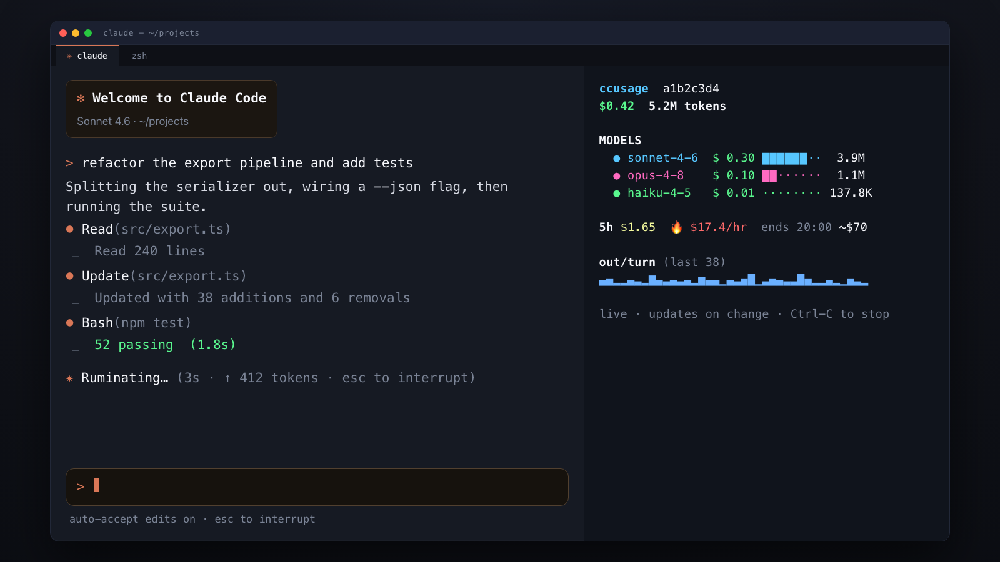

# ccusage-backpack-monitor

A Claude Code plugin that pops open a **side pane** showing a **live,
change-driven cost readout** for the session you just started — and closes that
pane automatically when the session ends. Think of it as a usage "backpack" your
session carries while it runs.

It reads Claude Code's own transcripts, so it prices **every model** (including
ones released after this plugin was), counts **subagent and workflow spend**
against the session that spawned it, and renders in ~0.07s.

It works in **herdr**, **tmux**, **WezTerm**, and **iTerm2**, on **macOS and
Linux**.

<p align="center">
  
</p>

> **Status:** v0.12.0 — supports herdr (macOS/Linux), tmux (macOS/Linux),
> WezTerm (macOS/Linux), and iTerm2 (macOS). In any other terminal the hooks
> no-op silently, so it's safe to install anywhere.

## Why

`/usage` is a one-shot, machine-local snapshot. This gives you an always-on,
per-session readout in a pane beside your work — without polling on a timer. It
watches only *this* session's files and redraws only when something actually
changed, so it's near-live yet idle-cheap.

Three things it gets right that a generic `ccusage session` call does not:

- **New models are priced.** Tools that price from a snapshot baked in at
  release time show `$0.00` for anything newer — that is why Opus 5 and Sonnet 5
  read as free next to millions of tokens. Pricing here refreshes daily and
  falls back to per-family estimates (marked `~`) rather than to zero.
- **Subagents are counted.** Task agents and workflow fan-out write to their own
  transcripts; their spend is attributed back to the session that spawned it.
  On one measured session that was $523 across 171 agents, and two models that
  otherwise never appeared at all.
- **Messages are counted once.** A single assistant reply is written to the
  transcript once per content block, each line repeating the same cumulative
  usage — counting the lines bills a 13-block reply thirteen times.

## Requirements

- **A supported terminal**, any one of:
  - **[herdr](https://herdr.dev)** (macOS or Linux) — the pane is a
    `herdr pane split`, inside herdr's own tab.
  - **tmux** (macOS or Linux) — the pane is a `tmux split-window`.
  - **WezTerm** (macOS or Linux) — the pane is a `wezterm cli split-pane`.
  - **iTerm2** (macOS) — the pane is opened via iTerm2's AppleScript.

  Detection is automatic and ordered **herdr → tmux → WezTerm → iTerm2**: a
  multiplexer owns the layout of the pane Claude runs in, so splitting the GUI
  terminal around it would put the monitor outside that layout — over the whole
  window, and still there after you switch tabs. So if you run herdr or tmux
  inside iTerm2 or WezTerm, the multiplexer's split is used. You can force a
  choice with `CBM_BACKEND` (see Configuration).

  One exception to the order: `$TMUX` wins over herdr. herdr's variables are
  ordinary environment variables, so a tmux server first started from a herdr
  pane keeps handing them to every window opened from it afterwards — including
  ones attached from a plain terminal, where splitting on that stale pane id
  would put the monitor somewhere unrelated. When both are set the tmux pane is
  where Claude actually is. If you run herdr *inside* tmux, set
  `CBM_BACKEND=herdr`.
- **`python3`** — the only real dependency, resolved via your `PATH` (macOS
  ships one at `/usr/bin/python3`; it may prompt to install the Xcode Command
  Line Tools the first time). No pip packages; the standard library is enough.
- [`ccusage`](https://github.com/ryoppippi/ccusage) is **optional** — used only
  as a fallback renderer if `python3` is missing.
- On iTerm2 only, a one-time macOS Automation prompt ("iTerm wants to control
  iTerm") must be allowed.

### Where it works (and where it no-ops)

| Scenario | Behaviour |
|---|---|
| herdr / tmux / WezTerm / iTerm2 + python3 | Full rich panel (cost, agents, burn rate, sparkline) |
| Supported terminal, no python3, ccusage present | Plain `ccusage` text fallback, still live |
| Supported terminal, **neither** | Pane shows the exact, OS-aware fix and becomes a shell so you can run it |
| herdr, tmux or WezTerm on **Linux** | Full support |
| Any other terminal (plain Terminal.app, kitty, Ghostty, …) | Hooks **no-op silently** (safe to leave installed) |

> **In an unsupported terminal (Terminal.app, VS Code, Ghostty, …)?** Those apps
> have no scriptable split-pane, so the plugin can't draw the monitor there. The
> universal workaround is **tmux**: run `tmux`, then `claude` inside it, and the
> monitor opens as a tmux split — in *any* terminal.

No `watch`, `jq`, `node`, or charting libraries are required — the only hard
runtime dependencies are a supported terminal and the stock `python3`.

## Install

Inside Claude Code:

```text
/plugin marketplace add thekoalaperson/ccusage-backpack-monitor
/plugin install ccusage-backpack-monitor@ccusage-backpack-monitor
```

Then start a fresh `claude` in herdr, tmux, WezTerm, or iTerm2 — a side pane opens
automatically.

<details>
<summary>Local development install</summary>

Point the marketplace at a local checkout instead of GitHub:

```text
/plugin marketplace add /path/to/ccusage-backpack-monitor
/plugin install ccusage-backpack-monitor@ccusage-backpack-monitor
```

An open pane picks up an updated watcher by itself, on its next redraw — `bash`
reads a running script from an open descriptor by offset, so without that a pane
left open for days would keep running the build it started with.
</details>

## Commands

`/ccusage-backpack-monitor:ccusage-monitor` — **toggles** the monitor pane for
the **current** session: run it once to open, again to close. Plugin commands are
namespaced, so type `/ccusage` and let autocomplete finish it.

If the open pane was started by an older version of the plugin (i.e. you upgraded
mid-session), or a stray duplicate is open, toggling **replaces** them with a
single current pane instead of closing, and says so. Panes belonging to other
Claude sessions are left alone. A running pane is a long-lived process, so `/plugin` + `/reload-plugins`
alone can't update it — this is how you pick up a new version without restarting
Claude.

## Configuration

Set these as environment variables before launching `claude`:

| Var                  | Default       | Meaning                                              |
|----------------------|---------------|------------------------------------------------------|
| `CBM_POLL`           | `3`           | Seconds between cheap file-change checks              |
| `CBM_SPLIT`          | `vertically`  | `vertically` (side-by-side) or `horizontally`        |
| `CBM_SIZE`           | `25`          | Percent of the terminal the monitor pane takes (clamped to 5–90). The main Claude session keeps the rest, so the default is a 3:1 split in Claude's favor. Applies to **all** backends (herdr, tmux, WezTerm, iTerm2). |
| `CBM_BACKEND`        | _(auto)_      | Force a terminal backend: `herdr`, `tmux`, `wezterm`, or `iterm`. Unset = auto-detect (herdr → tmux → WezTerm → iTerm2). `$TMUX` wins over herdr when both are set, so set this to `herdr` if you run herdr inside tmux. |
| `CBM_WEZTERM_PERCENT`| `CBM_SIZE`    | WezTerm-only override for the split size (percent of the source pane). Unset, it inherits `CBM_SIZE`. |
| `CBM_BLOCKS`         | `1`           | `0` hides the 5h burn-rate/projection section        |
| `CBM_TABS`           | `1`           | `0` disables the tab strip and arrow-key navigation — a single static panel |
| `CBM_LIMITS`         | `1`           | `0` hides the account rate-limit meters (5h / weekly) |
| `CBM_ACCOUNT`        | _(name only)_ | `0` hides account identity entirely; `full` adds your email and organisation name |
| `CBM_AGENTS`         | `1`           | `0` hides the subagent breakdown                     |
| `CBM_GRAPH`          | `1`           | `0` hides the sparkline                              |
| `CBM_CONTEXT`        | `1`           | `0` hides the context-window gauge                   |
| `NO_COLOR`           | _(unset)_     | Set (any value) to disable ANSI color entirely ([no-color.org](https://no-color.org)). `CBM_BG` overrides it. |
| `CBM_NO_NETWORK`     | _(unset)_     | `1` pins pricing to the bundled table (no daily refresh) |
| `CBM_BG`             | _(unset)_     | A 256-color index (e.g. `234`) paints an opaque background card behind the panel — useful in **transparent terminals**. Unset = solid high-contrast text, no fill. |
| `CBM_ALTSCREEN`      | `1`           | The panel draws on the terminal's **alternate screen**, like `vim` or `less`, so the pane's previous contents come back when it exits. `0` draws on the primary buffer instead and clears scrollback on the way in. Either way the panel erases nothing as it runs, so redraws cannot reach scrollback. |

The panel shows **every model used in the session** — including those used by
subagents — with its own cost, a cost-share bar, and token count. When a session
spawned agents, the header splits the total into what you spent directly versus
what your agents spent, and an `AGENTS` section lists the biggest ones.

A **context gauge** (`ctx ██████···· 58%  577K/1.0M`) shows how full the window is,
taken from the last turn's input side. The percentage appears only when the
model's context window is actually known; for an unrecognised model the raw token
count is shown instead of a percentage against a guessed window.

The layout **adapts to the pane width** — fields are dropped in order of
importance, so a 24-column pane degrades gracefully instead of wrapping.

### Rate limits, plan, and account

On a subscription the dollar figures are **notional** — you don't pay them. What
actually stops you mid-task is the percentage of your rate limit, so the panel
also shows the **5-hour** and **weekly** windows as meters beside the context
gauge, each with its real reset time:

```
ctx  ██········  21%  208.7K/1.0M
5h   ··········   0%  15:50
week ██········  21%  Fable  Wed 10:30
```

The weekly cap in particular is invisible to anything that only reads
transcripts, and it is usually the one that bites.

These come from **Claude Code's own cache** of the server's limit state
(`~/.claude.json`), read-only. The monitor **never fetches them itself** — that
would mean calling Anthropic from a status pane and would break the idle-cost
promise. It reports how old the cached figure is instead, and marks a percentage
`~` once it is old enough that it might have moved. The `limits` tab always
prints the exact age.

Because these are private client internals with no compatibility promise, every
field is read defensively: if a future release renames or drops one, the row
disappears and nothing else changes.

Your **plan** (`Max 5x`, `Pro`, `Team`, …) is shown from the same file. Identity
defaults to a **first name only**, because this pane ends up in screen-shares and
recordings; `CBM_ACCOUNT=full` opts into the email and organisation name, and
`CBM_ACCOUNT=0` turns it off entirely.

### Tabs

The header — spend and the three meters — is **pinned to every tab**, so the
numbers worth watching never need a keystroke. Below it, six views:

| Tab       | What's on it                                                        |
|-----------|---------------------------------------------------------------------|
| `live`    | models, agents, burn rate, tokens-per-turn sparkline                |
| `limits`  | every rate limit with exact reset times, credits, plan, cache age   |
| `models`  | per model: in/out, cache read/write, the 1h-vs-5m write split, $/turn |
| `agents`  | the full subagent list with models and last-active times            |
| `trend`   | 7-day account-wide token history, lifetime totals                   |
| `account` | who you are, what plan, and what this session is (branch, effort, mode) |

Keys — the pane must have **keyboard focus** first (in tmux, `Ctrl-b` then an
arrow):

| Key      | Action                        |
|----------|-------------------------------|
| `←` `→`  | previous / next tab           |
| `Tab`    | next tab                      |
| `1`–`6`  | jump straight to a tab        |
| `r`      | redraw now                    |
| `?`      | show the key list once        |
| `q`      | drop to a shell               |

The strip is numbered (`1 live  2 limits  …`) so the jump keys are visible
without asking for help, and the active tab is highlighted — bracketed under
`NO_COLOR`.

This costs nothing when idle: the keypress read **replaces** the sleep at the end
of the watch loop rather than adding to it, so the poll interval is unchanged.
Without a terminal on stdin it falls back to `sleep` and behaves exactly as
before. `CBM_TABS=0` restores the single static panel.

A `~` anywhere on the panel means the same thing throughout: a figure we will
not vouch for as current or exact — an estimated rate, or a cached limit old
enough to have moved. The `limits` tab always prints the cache's exact age
regardless.

Because the panel redraws in place, it runs on the terminal's **alternate
screen** (as `vim` and `less` do), so nothing it draws is ever left behind in
scrollback. Leaving it — `q`, `Ctrl-C`, or the session ending — restores the
pane. See `CBM_ALTSCREEN` if your terminal doesn't support it.

### Pricing

Rates come from a bundled table, refreshed at most once a day from
[LiteLLM](https://github.com/BerriAI/litellm) into
`~/.local/state/ccusage-backpack-monitor/pricing.json`. A model missing from
both falls back to a per-family estimate and is marked `~` in the panel, so a
newly released model is never silently free. To pin a rate yourself, create
`~/.config/ccusage-backpack-monitor/pricing.json`:

```json
{ "claude-opus-5": { "input": 5.0, "output": 25.0 } }
```

Values are USD per million tokens; cache rates are derived (read 0.1x input,
5-minute write 1.25x, 1-hour write 2x) unless given explicitly.

## Performance

The watcher is **change-driven, not interval-driven**. When idle it only does a
cheap `stat` on this session's transcript and its subagent directory every
`CBM_POLL` seconds — no subprocess, no parsing. It renders only when something
actually changed, so cost is proportional to real activity, not wall-clock time.

A render is **~0.07s**. Earlier versions shelled out to `ccusage session`, which
rescans every transcript on the machine — ~2s wall and ~16 CPU-seconds, on every
turn. Reading only this session's files removed that. Per-file results are
memoised by size and mtime in
`~/.local/state/ccusage-backpack-monitor/scan-cache.json`, so finished agents are
never re-read.

## How it works

| Phase  | File                | Hook           | Action                                          |
|--------|---------------------|----------------|-------------------------------------------------|
| open   | `bin/open-pane.sh`  | `SessionStart` | split pane, run watcher, stash the backend + pane handle |
| render | `bin/watch.sh`      | —              | stat transcript + agents; on change, draw       |
| panel  | `lib/render.py`     | —              | rich colored cost/agents/burn-rate view         |
| cost   | `lib/usage.py`      | —              | transcript scan, dedup, subagent attribution    |
| pick   | `bin/resolve-session.py` | —         | works out which session a pane should follow    |
| rates  | `lib/pricing.py`    | —              | model pricing with daily refresh + fallbacks    |
| close  | `bin/close-pane.sh` | `SessionEnd`   | look up the handle, close that exact pane via its backend |

**Backends.** All terminal-specific logic lives in `lib/common.sh` as small
per-backend functions — `cbm_{detect,open,alive,close}_<backend>`. A cached
`cbm_backend()` picks the active one (herdr → tmux → WezTerm → iTerm2). Adding a new
terminal (kitty, Ghostty, …) is four functions plus one word in that list.

State (one tiny `<session-id>.pane` file per session) lives in
`~/.local/state/ccusage-backpack-monitor` and self-prunes after a day. It records
the **backend** and the **pane handle** (two lines) so the `SessionEnd` hook — a
fresh process whose environment may differ — closes via the recorded backend
rather than re-detecting. (A fixed path on purpose: the hooks and the slash
command must agree on it, so the close hook can find a pane the command opened.)

## Tests

```sh
python3 tests/test_usage.py
```

145 fixture-based regression tests covering pricing resolution, deduplication,
subagent attribution, 5h block math, context-window handling, session
resolution (agents are never mistaken for sessions), the open/close/restart
toggle, the terminal backends (against a stand-in CLI, so no real panes are
opened), and panel rendering (including an overflow check at every pane width).
They build their own transcripts in a temp directory — they never read your real
usage data and never touch the network.

## Roadmap

- More terminals: kitty, Ghostty (herdr, tmux, WezTerm, and iTerm2 are supported)
- A companion skill/command for on-demand usage summaries
- Optional context-window % in the panel

## License

MIT
